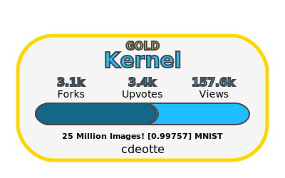
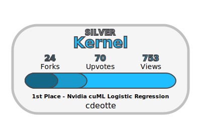
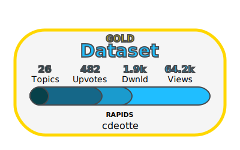

# Kaggle Connection
## Automatic badges for everything Kaggle
*Display stats from your kaggle profile, datasets and notebooks within github. Automatically updated through GitHub Actions.*

### Notebooks

### Datasets

